<p align="center">
  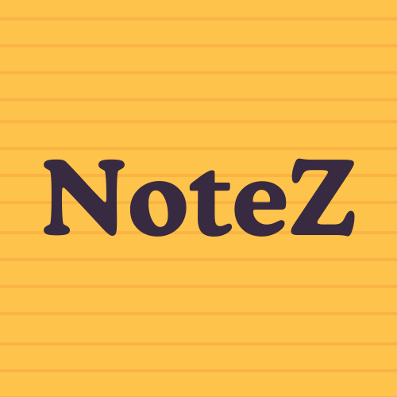
</p>

<h1 align="center">Notez</h1>

<p align="center">
  
  
  
  
  
</p>

---

## 📜 About

**Notez** is a clean and minimal Android notes application built from scratch with **Flutter**.  
It uses **Isar** for local database management and provides:

- 📝 **CRUD Operations** – Create, Read, Update & Delete notes  
- 🎨 **Interactive Whiteboard** – Draw and save sketches alongside your notes  
- 📤 **Export All Notes** – Backup your entire collection in one tap  
- 🌗 **Light & Dark Themes** – Comfortable UI for any environment  
- ⚡ **Fast & Local** – Powered by the super-fast Isar database  

---

## 📸 Screenshots

<p align="center">
  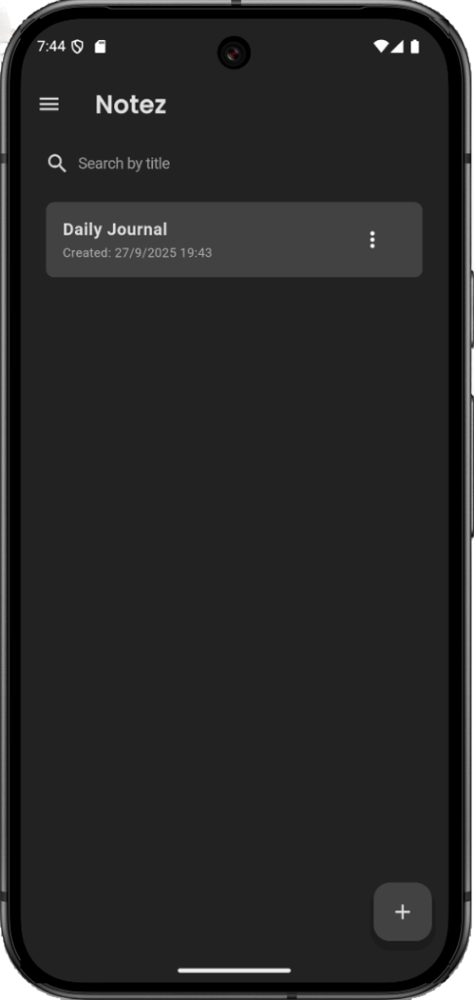
  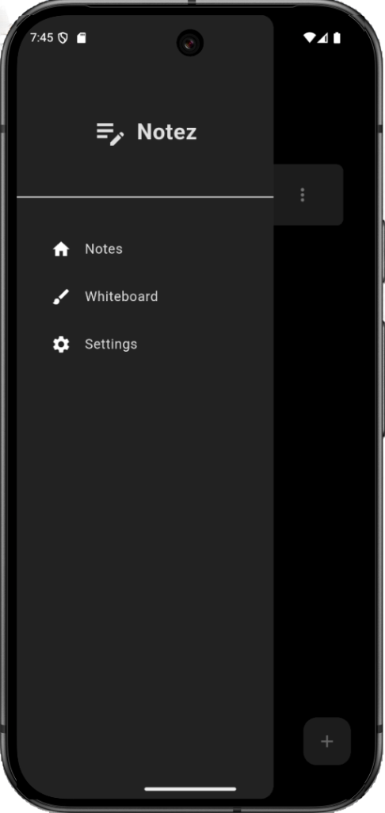
  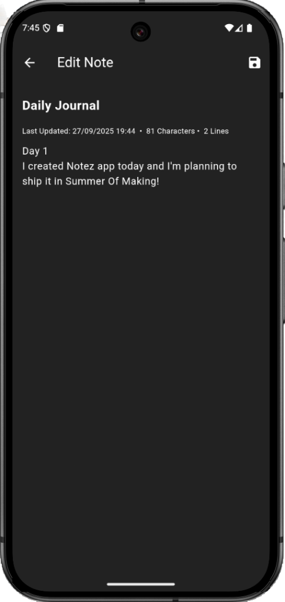
  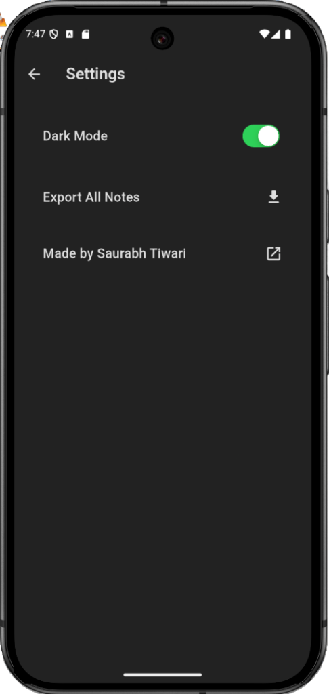
  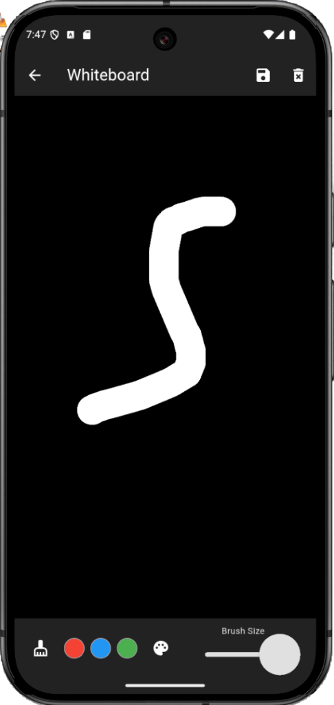
</p>

<p align="center">
  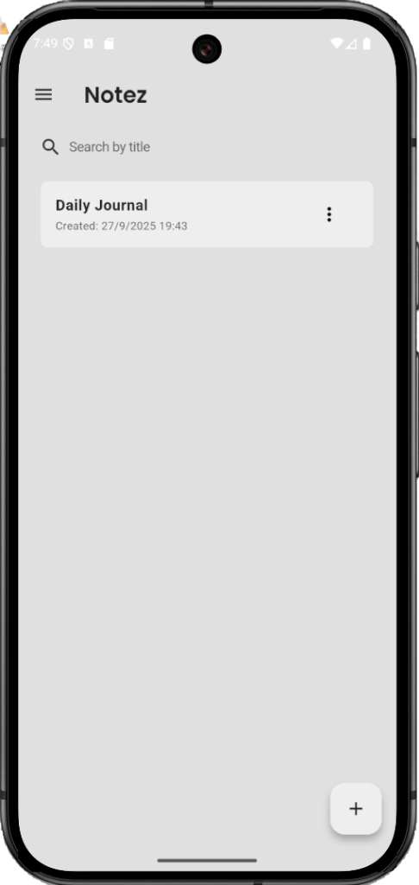
  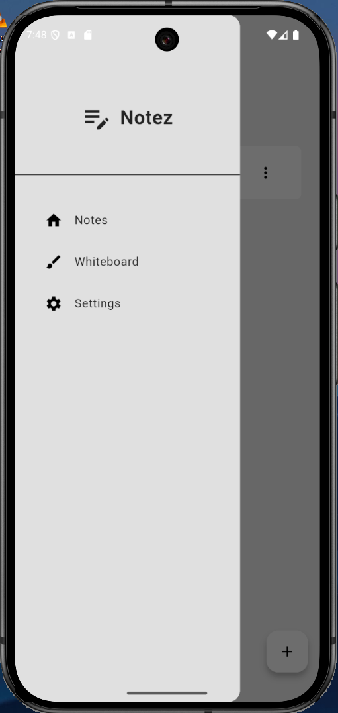
  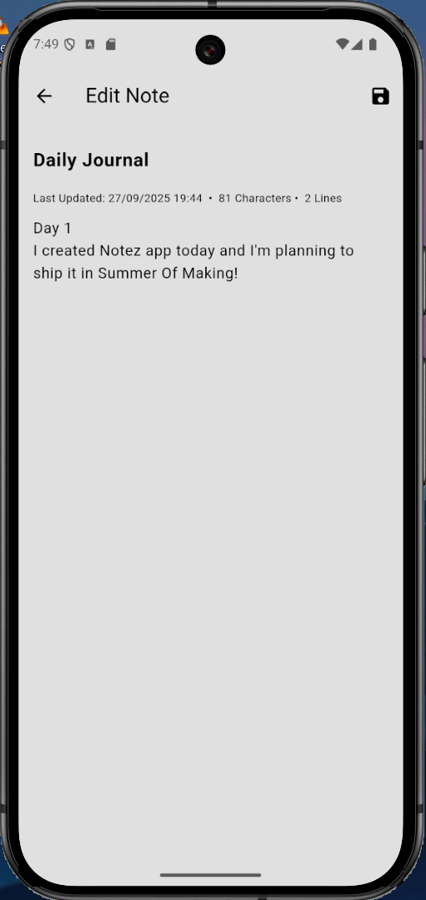
  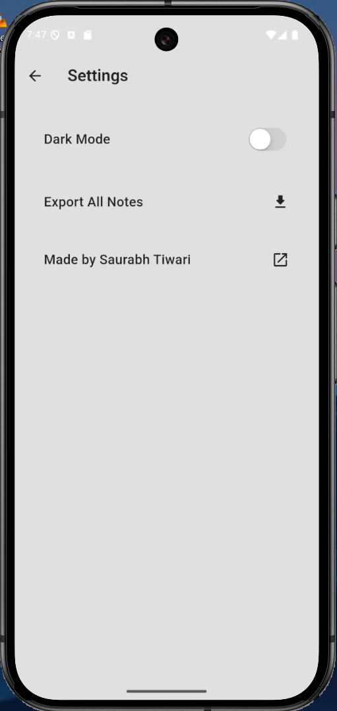
  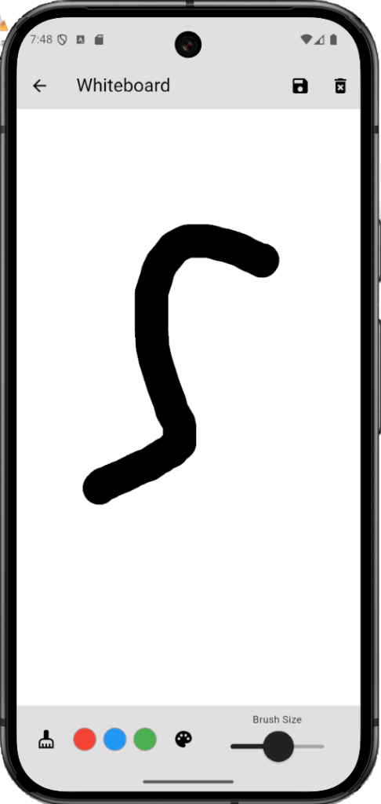
</p>

---

## ✨ Download & Links

- 🌐 **Website / APK Download**: [Notez](https://notez.pythonanywhere.com/)  
- 📱 **Android APK**: Available now  
- 🍏 **iOS**: Coming Soon  

---

## 🖥️ Technology Stack

- [Flutter](https://flutter.dev/) 3.13
- [Dart](https://dart.dev/) 3.3
- [Isar Database](https://isar.dev/) – Local NoSQL database
- Material 3 UI

---

## 🚀 Getting Started

### Prerequisites
- Flutter SDK **3.13+**
- Android Studio or VS Code
- Git

### Installation (Development)
```bash
git clone https://github.com/Rexaintreal/Notez.git
cd Notez
flutter pub get
flutter run

```

## 📂 Project Structure

```
Notez/
├── lib/                 # Dart source code
│   ├── components/      # UI components
│   ├── models/          # Database models
│   ├── pages/           # App screens
│   └── theme/           # App themes
├── assets/              # Logos, screenshots, images
├── android/             # Android build files
├── ios/                 # iOS build files
├── pubspec.yaml
└── README.md
```

---

## ⚠️ Current Status

- **Android APK**: Available now on [Link](https://notez.pythonanywhere.com/)
- **iOS**: Coming soon  

NoteZ is in active development. Feedback and contributions are welcome!

---

## 🔮 Future Plans
 

---

## 🤝 Contributing

Contributions are welcome!  

1. Fork the repository  
2. Create a branch: `git checkout -b feature/amazing-feature`  
3. Make your changes  
4. Commit: `git commit -m 'Add some amazing feature'`  
5. Push: `git push origin feature/amazing-feature`  
6. Open a Pull Request  

---

## 📜 License

This project is licensed under the [MIT License](LICENSE).  

---

## 💡 You may also like...

- [Sorta](https://github.com/Rexaintreal/Sorta) - A Sorting Algorithm Visualizer
- [Ziks](https://github.com/Rexaintreal/Ziks) - A physics simulator with 21 Simulatons made using vanilla JS
- [Eureka](https://github.com/Rexaintreal/Eureka) - A website to find local spots near you which don't show up on Google Maps
- [DawnDuck](https://github.com/Rexaintreal/DawnDuck) - USB HID Automation Tool for Morning Routines
- [Lynx](https://github.com/Rexaintreal/lynx) - OpenCV Image Manipulation WebApp
- [Libro Voice](https://github.com/Rexaintreal/Libro-Voice) - PDF to Audio Converter
- [Snippet Vision](https://github.com/Rexaintreal/Snippet-Vision) - YouTube Video Summarizer
- [Weather App](https://github.com/Rexaintreal/WeatherApp) - Python Weather Forecast App
- [Python Screenrecorder](https://github.com/Rexaintreal/PythonScreenrecorder) - Python Screen Recorder
- [Typing Speed Tester](https://github.com/Rexaintreal/TypingSpeedTester) - Python Typing Speed Tester
- [Movie Recommender](https://github.com/Rexaintreal/Movie-Recommender) - Python Movie Recommender
- [Password Generator](https://github.com/Rexaintreal/Password-Generator) - Python Password Generator
- [Object Tales](https://github.com/Rexaintreal/Object-Tales) - Python Image to Story Generator
- [Finance Manager](https://github.com/Rexaintreal/Finance-Manager) - Flask WebApp to Monitor Savings
- [Codegram](https://github.com/Rexaintreal/Codegram) - Social Media for Coders
- [Simple Flask Notes](https://github.com/Rexaintreal/Simple-Flask-Notes) - Flask Notes App
- [Key5](https://github.com/Rexaintreal/key5) - Python Keylogger
- [Codegram2024](https://github.com/Rexaintreal/Codegram2024) - Modern Codegram Update
- [Cupid](https://github.com/Rexaintreal/cupid) - Dating Web App for Teenagers
- [Gym Vogue](https://github.com/Rexaintreal/GymVogue/) - Ecommerce for Gym Freaks
- [Confessions](https://github.com/Rexaintreal/Confessions) - Anonymous Confession Platform
- [Syna](https://github.com/Rexaintreal/syna) - Social Music App with Spotify
- [Apollo](https://github.com/Rexaintreal/Apollo) - Minimal Music Player with Dancing Cat
- [Eros](https://github.com/Rexaintreal/Eros) - Face Symmetry Analyzer
- [Notez](https://github.com/Rexaintreal/Notez) - Clean Android Notes App

---

## 👨‍💻 Author

Apollo was created by **Saurabh Tiwari**  

- 📧 Email: [saurabhtiwari7986@gmail.com](mailto:saurabhtiwari7986@gmail.com)  
- 🐦 Twitter: [@Saurabhcodes01](https://x.com/Saurabhcodes01)
- 📱 Instagram: [@saurabhcodesawfully](https://instagram.com/saurabhcodesawfully)
